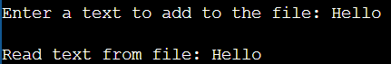

# EX.7-IMPLEMENTATION-OF-SYSTEM-CALLS-READ-WRITE-FORK-OPEN-CLOSE

## AIM:
To write a C program using open, read, write, close , create , fork system calls.
## THEORY :
There are 5 basic system calls that Unix provides for file I/O.

1.      Create: Used to Create a new empty file
        Syntax :int creat(char *filename, mode_t mode)
        filename : name of the file which you want to create
        mode : indicates permissions of new file.

2.    Open: Used to Open the file for reading, writing or both. Syntax: int open(char *path, int flags [ , int mode ] );
        Path : path to file which you want to use
        flags : How you like to use
            O_RDONLY: read only,
            O_WRONLY: write only,
            O_RDWR: read and write,
            O_CREAT: create
        file if it doesn’t exist, O_EXCL: prevent creation if it already exists

3.    Close: Tells the operating system you are done with a file descriptor and Close the file which pointed by fd.
        Syntax: int close(int fd);
        fd :filedescriptor

4.    Read: From the file indicated by the file descriptor fd, the read() function reads cnt bytes of input into the memory area indicated by buf. A successful read() updates the access time for the file.
        Syntax: int read(int fd, char *buf, int size);
        fd: file descripter
        buf: buffer to read data from
        cnt: length of buffer

5.    Write: Writes cnt bytes from buf to the file or socket associated with fd. cnt should not begreater than INT_MAX (defined in the limits.h header file). If cnt is zero, write() simply returns 0 without attempting any other action.
        Syntax: int write(int fd, char *buf, int size);
        fd: filedescripter
        buf: buffer to write data to
        cnt: length of buffer
        *File descriptor is integer that uniquely identifies an open file of the process.

## ALGORITHM:

1.    Start the program.
2.    Create a file using open system call.
3.    Write the contents to the file using write system call.
4.    Read the contents from the file using read system call.
5.    Close the file using close system call.
6.    Fork the process using fork system call.
7.    Stop the program.

## PROGRAM:
```

#include <sys/stat.h>
#include <stdio.h>
#include <fcntl.h>
#include <sys/types.h>

int main() {
    int n, i = 0;
    int f1, f2;
    char c, strin[100];

    // Use open instead of fopen for file descriptor operations.
    f1 = open("data.txt", O_RDWR | O_CREAT | O_TRUNC, S_IRUSR | S_IWUSR);

    printf("Enter a text to add to the file: ");
    while ((c = getchar()) != '\n') {
        strin[i++] = c;
    }
    strin[i] = '\0';

    // Use write instead of fwrite for file descriptor operations.
    write(f1, strin, i);
    close(f1);

    f2 = open("data.txt", O_RDONLY);

    // You should read into the buffer correctly by specifying the number of bytes to read.
    // In this case, you can use i to specify the number of bytes to read.
    read(f2, strin, i);

    printf("\nRead text from file: %s\n", strin);

    close(f2);  // Use close, not pclose

    fork();

    return 0;
}

```

## OUTPUT:


## RESULT:
Thus, open, read, write, close , create , fork() system calls implemented successfully using C program.
